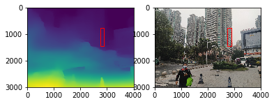
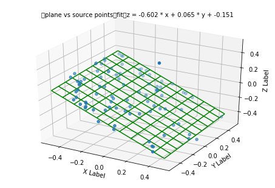

# 1 概述

使用三种方法进行三维点云拟合：a.PaddlePaddle2.0基础API的NN梯度下降，b. SVD, c. PCA。支持读取3D点云文件或通过PaddleHub的MiDaS模型把2D图转深度图后获取点云。对获得的点云文件进行平面拟合。

照例先给出拟合效果：


- aistudio项目地址：https://aistudio.baidu.com/aistudio/projectdetail/3988461

## 1.1项目内容：
- 本项目包含**1.三维点云数据的多种获取方法，2.三维点云的平面拟合方法，3.计算平面相对摄像机角度**。网上介绍的比较零散，做一个整合。
- 通过Paddlehub中的MiDaS_Large模型，从普通照片中获取深度图及点云，或读取三维摄像头保存的三维文件
- 使用SVD,PCA，以及NN梯度下降，三种方法来拟合点云的平面方程及求出平面相对摄像机的倾角
- 使用PaddlePaddle2.0中动态图的方法构建NN，使用2.0中的基础API进行梯度下降，并融合了基础的一些梯度下降常用操作：early stopping，特定值初始化参数等
- PS:若想直接看效果的用户可直接跳过本文介绍，运行main.py或run.py可看到结果。有耐性的也可运行本notebook

## 1.2 三种三维点云的平面拟合方法：

具体结果见

|方法 |简介 |抗噪声干扰 |速度|
| -------- | -------- | -------- | -------- |
|SVD，最小二乘法     |是最早期的拟合方法，对真实中有噪声的点云效果差     | 差     |快|
|PCA主成分分析    |速度快，抗噪声的能力一般，一些异常点会影响整体效果     | 中等     |中|
|PaddlePaddle动态图的NN梯度下降     |把平面方程z=ax+by+d中的a,b,d作为nn网络的参数， <br>通过求预测的z与实际的z之间均方差作为损失函数， <br>不断调节a,b,d使loss最小（即z最接近实际值），最终求得平面方程    | 好     |慢|

 
   


## 1.3 三种获取三维点云的方法：

具体结果见

|方法 |简介 |主观评论|
| -------- | -------- |----- |
|平面方程生成     |给出ax+by+cz+d=0中的参数来生成     | 最常见方法
|读取三维摄像头保存的ply文件    |读取Intel Realsense 415拍摄保存的文件     |适用于中短距离点云获取分析，机器人，无人机中常用|
|从普通照片获取三维点云    | 从图片中生成深度图，深度图中映射出点云     |适用于远距离平面分析，数据不受限制|


# 2 生成点云数据

进行点云的平面拟合，我们需要获取点云数据。下面介绍3种方式，已有自己点云数据的可以直接跳到第3章。


## 2.1 读取点云文件：
> 详见functionTools.py中的 makePoint，getPlyPoint，getTxtPoint方法


### 2.1.1 平面方程生成

输入平面的x，y范围；平面方程的a,b,c,d 系数；及生成的点数量；将输出pointsNum个点。点的x,y,z坐标分别存在独立的数组中
```
 makePoint(xmin,ymin,xmax,ymax,a=3,b=2,d=1,pointsNum=40)
```

### 2.1.2 读取三维摄像头保存的ply文件

输入ply文件的文件名，需要从ply文件中截选分析的区域，通过x，y范围限制；将输出ply文件中所有该区域中的点，若不设置x，y范围则输出所有点
```
getPlyPoint(fileName='45-45.ply',xmin=None,ymin=None,xmax=None,ymax=None):
```
- a.ply文件不仅包含三维点的x,y,z坐标，还包含面片信息，也包含颜色等信息，与obj，stl文件都是较常见的三维数据格式。PLY文件介绍可见 [https://www.cnblogs.com/gcczhongduan/p/5230496.html](https://www.cnblogs.com/gcczhongduan/p/5230496.html)
- b. python有plyfile这个库可以读，具体读入方法见functionTools中getPlyPoint函数
- c. 通过numpy的where作点的筛选，获取符合的点的index的List再输出。这里在np.where中用 & 来实现多个条件的交集
```
indexList=np.where((xList>xmin)&(xList<xmax)&(yList>ymin)&(yList<ymax))
x2 = [xList[ii] for ii in indexList][0]
y2 = [yList[ii] for ii in indexList][0]
z2 = [zList[ii] for ii in indexList][0]
```
> 这里用Intel Realsensse摄像头拍摄一个成90°的墙面与地面，地面是放了一个小盒子。把该帧数据保存到test.ply中。可使用windows的3D Builder查看，在x轴方向有2个成90度的平面，其中有一个小台阶，如下图：


--  图a.--
       
### 2.1.3 从普通照片获取三维点云
- a.普通照片使用MiDaS_Large生成深度图，并把该深度信息用numpy的savetxt保存该二维float数组到txt文件【具体见2.1.3-d】
- b.传入txt路径及所要截取的x,y范围的值，截取点云
```
getTxtPoint(path,xmin,ymin,xmax,ymax)

```
- c. MiDaS_Large 模型的介绍可见Paddlehub中介绍，本人亲测看深度图的效果还是杠杠的，室内室外效果都还不错，但要拿来作精确的分割就还不太行。

[Paddlehub中模型链接](https://github.com/PaddlePaddle/PaddleHub/tree/release/v2.2/modules/image/depth_estimation/MiDaS_Large)

[Paperswithcode链接](https://paperswithcode.com/paper/towards-robust-monocular-depth-estimation)


pytorch hub官网效果图

- d.PaddleHub中调用 MiDaS_Large 模型，生成普通照片的深度图，建议取中远景的照片，有一定的面积的平面的。代码参加下方（注意Paddlehub版本需为2.2.0）：


```python
# 注意aistudio默认版本paddlehub会报错，安装暂时最新的2.2.0 是ok
!pip install paddlehub==2.2.0
## 读取ply
!pip install plyfile
```


```python
import cv2
import os
os .environ['CUDA_VISIBLE_DEVICES']='0'
import paddlehub as hub
import numpy as np
path='source/IMG_20211223_093703.jpg'
# 模型加载
# use_gpu：是否使用GPU进行预测
model = hub.Module(name='MiDaS_Large', use_gpu=True)

img=cv2.imread(path)
assert len(img)>0
# 模型预测
result = model.depth_estimation(images=[img])
result=result[0]

np.savetxt('depthData.txt',result)
out=256*(result-np.min(result))/(np.max(result)-np.min(result))
out=np.array(out,dtype='uint8')
cv2.imwrite('depthPic.png',out)
##

```

> 下方代码生成的图为 深度图vs原图  (红色框位置是我们选取的点云区域）
- 看到生成的深度图还是可以的，除了最近的人那里有一大片外，其他与真实情况，看上去还是大概对上了


```python
%matplotlib inline
import matplotlib.patches as patches
import matplotlib.pyplot as plt
sourcePath='source/IMG_20211223_093703.jpg'
xmin, ymin, xmax, ymax =  [2740, 772, 2889, 1442]
fig, subs = plt.subplots(1,2)

subs[0].imshow(plt.imread('depthPic.png'))
subs[0].add_patch(
     patches.Rectangle(
        (xmin,ymin),
        xmax-xmin,
        ymax-ymin,
        edgecolor = 'red',
        facecolor = 'red',
        fill=False
     ) )
source=plt.imread(sourcePath)

subs[1].imshow(source)
subs[1].add_patch(
     patches.Rectangle(
        (xmin,ymin),
        xmax-xmin,
        ymax-ymin,
        edgecolor = 'red',
        facecolor = 'red',
        fill=False
     ) )

plt.show()
```

    /opt/conda/envs/python35-paddle120-env/lib/python3.7/site-packages/matplotlib/__init__.py:107: DeprecationWarning: Using or importing the ABCs from 'collections' instead of from 'collections.abc' is deprecated, and in 3.8 it will stop working
      from collections import MutableMapping
    /opt/conda/envs/python35-paddle120-env/lib/python3.7/site-packages/matplotlib/rcsetup.py:20: DeprecationWarning: Using or importing the ABCs from 'collections' instead of from 'collections.abc' is deprecated, and in 3.8 it will stop working
      from collections import Iterable, Mapping
    /opt/conda/envs/python35-paddle120-env/lib/python3.7/site-packages/matplotlib/colors.py:53: DeprecationWarning: Using or importing the ABCs from 'collections' instead of from 'collections.abc' is deprecated, and in 3.8 it will stop working
      from collections import Sized
    /opt/conda/envs/python35-paddle120-env/lib/python3.7/site-packages/matplotlib/cbook/__init__.py:2349: DeprecationWarning: Using or importing the ABCs from 'collections' instead of from 'collections.abc' is deprecated, and in 3.8 it will stop working
      if isinstance(obj, collections.Iterator):
    /opt/conda/envs/python35-paddle120-env/lib/python3.7/site-packages/matplotlib/cbook/__init__.py:2366: DeprecationWarning: Using or importing the ABCs from 'collections' instead of from 'collections.abc' is deprecated, and in 3.8 it will stop working
      return list(data) if isinstance(data, collections.MappingView) else data
    /opt/conda/envs/python35-paddle120-env/lib/python3.7/site-packages/numpy/lib/type_check.py:546: DeprecationWarning: np.asscalar(a) is deprecated since NumPy v1.16, use a.item() instead
      'a.item() instead', DeprecationWarning, stacklevel=1)





# 3 处理点云数据

## 3.1 通过设置inputType选择读取点云文件的方式：

- 1.可通过修改inputType前的注释来切换不同读入方式
- 2.对读入的点进行了归一化处理，归一化到0~1，也可归一化到-0.5～0.5
- 3.经筛选后，更新点数量与x,y 取值范围


```python
import  functionTools as FT

#1.可通过修改index切换不同读入方式
def fetchPoints(inputTypeIndex=1,normalizeFlag=True):
    # 深度图中或点云中选择ROI 区域
    # inputType='depthPic'
    # inputType='randomGenerate'
    # inputType='ply'
    inputTypeList=['depthPic','ply','randomGenerate']
    inputType=inputTypeList[inputTypeIndex]
    if inputType=='depthPic':
        xmin, ymin, xmax, ymax = [2740, 772, 2889, 1442]
        # 2740,772,2889,1442 右側面
        # 1948,474,2279,1110 左側面
        # xmin, ymin, xmax, ymax = [1948, 474, 2279, 1110]
        x1, y1, z1=FT.getTxtPoint('depthData.txt',xmin,ymin,xmax,ymax)
        x2,y2,z2=FT.randomChoice(x1,y1,z1,100)

    elif inputType=='ply':
        path='source/test.ply'
        print('ply files:',path)
        # x1,y1,z1=getPlyPoint(path)
        # plyPlot(x1, y1, z1)
        ##ply points
        xmin, ymin, xmax, ymax = [-0.5, -0.3, -0.178, 0.1]
        # xmin, ymin, xmax, ymax = [-0.178, -0.3, 0.75, 0.1]

        x1,y1,z1=FT.getPlyPoint(path,xmin,ymin,xmax,ymax)
        x2,y2,z2=FT.randomChoice(x1,y1,z1,100)
        #plyPlot(x2, y2, z2)
    elif inputType=='randomGenerate':
        xmin, ymin, xmax, ymax = [-0.5, -0.3, -0.178, 0.1]
        x2, y2, z2 = Ft.makePoint(xmin,ymin,xmax,ymax,a=1,b=0,d=0.0,pointsNum=100)
    print('point nums:',len(z2))
    # 2.对读入的点进行了归一化处理，归一化到0~1
    ## 归一化，归一化能提升各种拟合方式的准确度
    if normalizeFlag:
        x2,y2,z2=FT.normalize(x2,y2,z2)
    return x2,y2,z2

x2,y2,z2=fetchPoints(inputTypeIndex=1,normalizeFlag=True)

#3.经筛选后，更新点数量与x,y 取值范围
## 更新归一化及筛选后的点云数据
pointsNum=len(z2)
xmin,ymin,xmax,ymax=min(x2),min(y2),max(x2),max(y2)
```

    ply files: source/test.ply
    point nums: 100


# 4. 三维点云拟合 

## 4.1.SVD方法
> 详见fit.py中方法，使用numpy进行svd。

## 4.2. PaddlePaddle 的NN，动态图梯度下降法，逐渐逼近（拟合）平面方程参数

### a.基于动态图构建NN模型
a1. 参见paddleNN的方法，建立继承于paddle.nn.Layer的名为MyModel模型

a2. 在模型初始化时，通过`a = self.create_parameter([1])` 与 `self.add_parameter("a", a)`创建对应的a,b,d 3个参数变量，维度为[1]。a,b,d为MyModel的内变量，用self.a, self.b, self.d调用

a3. 默认stop_gradient为False，即梯度更新起效，无需设置。

a4. 从input里取出x与y,按平面方程计算z，期间用expand_as 扩展系数,使其与输入的batch数据数量一样，即shape一样。

```
# 平面方程: z = a * x_train + b * y_train + d
z = self.a.expand_as(x_train) * x_train + self.b.expand_as(x_train) * y_train + self.d.expand_as(x_train)
```


a5. 可以区分一下训练集与测试集，但其实在这里意义不大。主要演示可以自己决定拿多少点数据进行梯度下降。


```python
import paddle
class MyModel(paddle.nn.Layer):
    def __init__(self):
        super(MyModel, self).__init__()

        a = self.create_parameter([1])
        self.add_parameter("a", a)
        b = self.create_parameter([1])
        self.add_parameter("b", b)
        d = self.create_parameter([1])
        self.add_parameter("d", d)
        # self.a.stop_gradient=False
        # self.b.stop_gradient=False
        # self.d.stop_gradient=False
        # print(self.a,self.d)

    def forward(self, inputs):
        # print(self.a,self.d)
        x_train = inputs[0]
        y_train = inputs[1]
        z = self.a.expand_as(x_train) * x_train + self.b.expand_as(x_train) * y_train + self.d.expand_as(x_train)
        # print(self.a,self.d)
        return z


def paddleNN(x2,y2,z2,testNum=100):
    model = MyModel()
    x_train=np.array(x2[:-testNum])
    y_train=np.array(y2[:-testNum])
    z_train=np.array(z2[:-testNum])
    x_test=np.array(x2[:-testNum])
    y_test=np.array(y2[:-testNum])
    z_test=np.array(z2[:-testNum])
#######################################################
    loss_fn = paddle.nn.MSELoss(reduction='mean')

    # optimizer = paddle.optimizer.SGD(learning_rate=0.0001,
    #                                  parameters=model.parameters())
    optimizer = paddle.optimizer.AdamW(weight_decay=0.00002, learning_rate=0.001,
            parameters=model.parameters())
    # optimizer = paddle.optimizer.Momentum(weight_decay=0.00001, learning_rate=0.0001,
    #         parameters=model.parameters())

    total_data=len(x_train)
    batch_size=len(x_train)
    loss_list=[]
    steps=30000
    for t in range(steps * (total_data // batch_size)):
        idx = np.random.choice(total_data, batch_size, replace=False)
        xx = paddle.to_tensor(x_train[idx], dtype='float32')
        yy = paddle.to_tensor(y_train[idx], dtype='float32')
        zz = paddle.to_tensor(z_train[idx], dtype='float32')
        pred = model((xx,yy))

        loss = loss_fn(pred, zz)
        loss_list.append(loss)

        if t % 200 == 0:
            # print(model.parameters())
            print('step:',t, loss.numpy())
            #early stop
            if len(loss_list) > 200:
                if np.average(loss_list[-200:-100]) - np.average(loss_list[-100:]) < 0.0001:
                    print('EARLY STOP')
                    break
        loss.backward()
        optimizer.step()
        optimizer.clear_grad()
        
    print(model.parameters())
    adata=float(model.parameters()[0].numpy()[0])
    bdata = float(model.parameters()[1].numpy()[0])
    ddata=float(model.parameters()[2].numpy()[0])
    return adata,bdata,-1,ddata
```

> ~接上面代码说明：

- a6. loss损失函数使用均方差

```
loss_fn = paddle.nn.MSELoss(reduction='mean')
```

- a7.优化器可选用sgd梯度下降，adam，或带动量的，实际测试中adamW较佳

```
optimizer = paddle.optimizer.AdamW(weight_decay=0.00002, learning_rate=0.001,
            parameters=model.parameters())
```

- a8.开始训练（开始拟合）

使用30000步，随机选择训练（拟合）数据。这里直接全部train数据作为一个batch了。把x,y数据转为tensor送入模型,获取预测结果pred

- a9.比较pred与实际的z的差别，通过loss函数计算均方差。
```
 #early stop
 if len(loss_list) > 200:
    if np.average(loss_list[-200:-100]) - np.average(loss_list[-100:]) < 0.0001:
        print('EARLY STOP')
        break
```
加入上述代码是为了early stop。若loss长时间变化很小，已经不再下降了，则触发early stop跳出循环。


- a10.将loss反向，通过optimizer更新梯度，然后清除梯度，不断这样循环。
```
 loss.backward()
 optimizer.step()
 optimizer.clear_grad()
```


## 4.3. PCA主成分分析进行三维点云平面拟合

- a.使用sklearn的PCA来进行主成分分析，相当于在三维坐标中我们找一个角度来查看所有点都在一个平面上，这个平面的方向就是主成分方向，其垂直面为第2主成分方向。

更详细介绍可见：[https://scikit-learn.org/stable/auto_examples/decomposition/plot_pca_3d.html#sphx-glr-auto-examples-decomposition-plot-pca-3d-py](https://scikit-learn.org/stable/auto_examples/decomposition/plot_pca_3d.html#sphx-glr-auto-examples-decomposition-plot-pca-3d-py)


```python
%matplotlib inline
import time
from sklearn.decomposition import PCA
def pca3D(xx,yy,zz,svdSolver='full',points=None,showFlag=True):
    if points is None:
        points=np.c_[xx,yy,zz]
    # points=np.zeros((len(z2),3))
    # points[:,0]=x2
    # points[:,1]=y2
    # points[:,2]=z2
    t1=time.time()
    ## 定义3个主成分
    pcaPlane = PCA(n_components=3, svd_solver=svdSolver)
    result=pcaPlane.fit(points)
    V=pcaPlane.components_.T
    x_pca_axis,y_pca_axis,z_pca_axis=3 *V
    print('pca time',time.time()-t1)
    x_pca_plane = np.r_[x_pca_axis[:2], -x_pca_axis[1::-1]]
    y_pca_plane = np.r_[y_pca_axis[:2], -y_pca_axis[1::-1]]
    z_pca_plane = np.r_[z_pca_axis[:2], -z_pca_axis[1::-1]]
    x_pca_plane.shape = (2, 2)
    y_pca_plane.shape = (2, 2)
    z_pca_plane.shape = (2, 2)

    #取第1 与 第2 主成分点，加上点云的中心点，构成同一平面3个点
    x1, y1, z1 = pcaPlane.components_[0]
    x2, y2, z2 = pcaPlane.components_[1]
    x3, y3, z3 = np.average(xx), np.average(yy), np.average(zz)

    
    ###
    if showFlag:
        from mpl_toolkits.mplot3d import Axes3D
        import matplotlib.pyplot as plt
        ox, oy, oz = x3, y3, z3
        fig = plt.figure(1)
        plt.clf()
        ax = Axes3D(fig)

        ax.scatter(xx[::10], yy[::10], zz[::10],  marker="+", alpha=0.8)
        surfaceFlag=True
        if surfaceFlag:
            ax.plot_surface(x_pca_plane, y_pca_plane, z_pca_plane,
                            color='r',
                            alpha=0.5)
        else:
            ax.plot_wireframe(x_pca_plane, y_pca_plane, z_pca_plane,
                            rstride=10, cstride=10,color='r')

        ax.set_xlabel('X Label')
        ax.set_ylabel('Y Label')
        ax.set_zlabel('Z Label')
        for i, (comp, var) in enumerate(zip(pcaPlane.components_, pcaPlane.explained_variance_)):
            comp = comp * (1-var)  # scale component by its variance explanation power
            ax.quiver(ox, oy, oz, comp[0] + ox, comp[1] + oy, comp[2] + oz,
                    length=0.5, normalize=True,
                    color=f"C{i + 2}", )

        plt.show()
    ###

    aData = ((y2 - y1) * (z3 - z1) - (z2 - z1) * (y3 - y1))
    bData = ((z2 - z1) * (x3 - x1) - (x2 - x1) * (z3 - z1))
    cData = ((x2 - x1) * (y3 - y1) - (y2 - y1) * (x3 - x1))
    dData = 0 - (aData * x1 + bData * y1 + cData * z1)
    nVector = -1*np.cross(np.array([(x1 - x3), y1 - y3, z1 - z3]),
                       np.array([(x2 - x3), y2 - y3, z2 - z3]))
    
    return aData/cData,bData/cData,cData/cData,dData/cData,nVector
```


## 4.4 拟合的Main函数，选择对应的拟合方法拟合点云


```python

import fit
fitTypeList=['svd','paddleNN','PCA']
fitTypeIndex=1
fitType=fitTypeList[fitTypeIndex]
#
if fitType=='svd':
    adata,bdata,cdata,ddata=fit.svd(x2,y2,z2)
elif fitType=='paddleNN':
    adata,bdata,cdata,ddata=paddleNN(x2,y2,z2,1)
elif fitType=='PCA':
    adata,bdata,cdata,ddata,nVector=pca3D(x2,y2,z2,svdSolver='full')
print('平面方程的系数：adata,bdata,cdata,ddata,',adata,bdata,cdata,ddata)
print('平面拟合结果为：z = %.3f * x + %.3f * y + %.3f' % (adata, bdata, ddata))
```

    step: 0 [0.3068122]
    step: 200 [0.2269109]
    step: 400 [0.16959368]
    step: 600 [0.12604521]
    step: 800 [0.09337001]
    step: 1000 [0.06916611]
    step: 1200 [0.05146609]
    step: 1400 [0.03872039]
    step: 1600 [0.02973792]
    step: 1800 [0.02359681]
    step: 2000 [0.01956354]
    step: 2200 [0.01704337]
    step: 2400 [0.01555904]
    step: 2600 [0.01474248]
    step: 2800 [0.01432679]
    step: 3000 [0.01413283]
    EARLY STOP
    [Parameter containing:
    Tensor(shape=[1], dtype=float32, place=CPUPlace, stop_gradient=False,
           [-0.60219890]), Parameter containing:
    Tensor(shape=[1], dtype=float32, place=CPUPlace, stop_gradient=False,
           [0.06515705]), Parameter containing:
    Tensor(shape=[1], dtype=float32, place=CPUPlace, stop_gradient=False,
           [-0.15059726])]
    平面方程的系数：adata,bdata,cdata,ddata, -0.6021988987922668 0.06515704840421677 -1 -0.15059725940227509
    平面拟合结果为：z = -0.602 * x + 0.065 * y + -0.151


```python
import show
show.matplot(adata,bdata,ddata,x2,y2,z2,testNum=10,title='z = %.3f * x + %.3f * y + %.3f' % (adata, bdata, ddata))


########################
# 对x轴，对y轴，与x,y平面的复合角度
xAngle,yAngle,xyAngle=FT.quiver2angle([adata,bdata,-1])
print('平面角度',xAngle,yAngle)
```

    /opt/conda/envs/python35-paddle120-env/lib/python3.7/site-packages/numpy/lib/type_check.py:546: DeprecationWarning: np.asscalar(a) is deprecated since NumPy v1.16, use a.item() instead
      'a.item() instead', DeprecationWarning, stacklevel=1)
    /opt/conda/envs/python35-paddle120-env/lib/python3.7/site-packages/matplotlib/font_manager.py:1331: UserWarning: findfont: Font family ['SimHei'] not found. Falling back to DejaVu Sans
      (prop.get_family(), self.defaultFamily[fontext]))





    平面角度 31.002695650999343 -3.194791263176384


# 5.分析对比

> 实际拟合对比
- a.按“ 2 生成点云数据”中的深度图与ply文件两种方式获取点云数据，按实际中有不规则噪声点的情况（下图第1列）;
- b.下图第一列对应“3 点云处理”的方式中，具体筛选点的方法
- c.下图第2列，给出对用“4.点云拟合”中，具体的拟合方法
- d.拟合得到平面方程的系数，与该拟合平面绕x轴，绕y轴的旋转角（下图3~11列）
- e.实际中test.ply的两个选取的平面成90°，两个平面在x轴转交应该是-45°,45°（目测），y轴转交在0°左右。（见之前的图a.）


> 结论（若上表看得眼花，直接看结论）
- 1. svd速度最快，但抗噪声最差；pca两者处于中等（也是毫秒级）；nn的梯度下降抗噪声最好，速度最慢。
- 2. PCA中的两种svd方法，选用auto会在拟合点较少（40点）时有结果不稳定的情况。full会稳定一点
- 3. 使用nn梯度下降方法的，在点数较少（40点）时需拟合精度有影响，但没有svd 与 pca影响那么大
- 4. nn梯度拟合计算得到的旋转角误差均不超15°（目测），在高噪声点也有这表现觉得还是可以的了，pca与svd有时拟合出一眼看下去就不对的平面。
- 5. 上面结论是要不就精确度，要不就时间，只能2选1，有两者兼得的吗？

> 但我们是大人了，肯定要  “既时间短又精确度高” 的，只有小孩子才做选择！

- 大人最简单的方法就是把 PCA、NN梯度下降 组合起来：先进行PCA运算，如果方差大或者直接就把得到的结果作为nn网络的初始值，再做仔细拟合，因为这样梯度下降不需要走那么多步了。详见下方代码：


```python

class planeClass():
    def __init__(self):
        self.model=MyModel()
        self.loss_fn = paddle.nn.MSELoss(reduction='mean')
        self.checkTime=2*2
        self.learning_rate=0.04
        self.weight_decay=0.0015
        self.lossThreshold=0.00001
        self.optimizer = paddle.optimizer.AdamW(weight_decay=self.weight_decay, learning_rate=self.learning_rate,
                                   parameters=self.model.parameters())
        ##
        self.pcaPlane = PCA(n_components=3, svd_solver='auto')
    def run(self,xx,yy,zz,points=None,method=2):
        if points is None:
            points = np.c_[xx, yy, zz]
        aData,bData,cData,dData=self.pcaProcess(points,xx, yy, zz)
        print('pca:', aData, bData, cData, dData)
        if method>=2:
            aData,bData,cData,dData=self.nnProcess( [xx, yy, zz],
                                                    initData=[aData,bData,cData,dData])
        return aData,bData,cData,dData

    def pcaProcess(self,points,xx, yy, zz):
        ##用回 4.3 中的pca的方法
        aData,bData,cData,dData,_=pca3D(xx,yy,zz,svdSolver='full',points=points,showFlag=False)
        return aData,bData,cData,dData

    def nnProcess(self,trainData,initData=None):
        x_train,y_train,z_train=trainData
        x_train = np.array(x_train)
        y_train = np.array(y_train)
        z_train = np.array(z_train)
        ## 对NN模型中的参数赋初始值
        if initData is not None:
            self.model.a.set_value(paddle.to_tensor([initData[0]]))
            self.model.d.set_value(paddle.to_tensor([initData[1]]))
            self.model.b.set_value(paddle.to_tensor([initData[2]]))

        loss_list = []
        total_data=len(z_train)
        batch_size=len(z_train)
        self.lossThreshold=paddle.to_tensor(self.lossThreshold)
        for t in range(1000 ):
            idx = np.random.choice(total_data, batch_size, replace=False)
            xx = paddle.to_tensor(x_train[idx], dtype='float32')
            yy = paddle.to_tensor(y_train[idx], dtype='float32')
            zz = paddle.to_tensor(z_train[idx], dtype='float32')
            pred = self.model((xx, yy))

            loss = self.loss_fn(pred, zz)
            loss_list.append(loss)

            if t > 10*self.checkTime :
            #  loss变化不大则提早停止
                if np.abs(np.average(loss_list[-self.checkTime:int(-self.checkTime/2)])- \
                          np.average(loss_list[int(-self.checkTime / 2):]))<self.lossThreshold:
                    print('EARLY STOP:',len(loss_list),loss_list)
                    break
            # break
            loss.backward()
            self.optimizer.step()
            self.optimizer.clear_grad()
            # break

        print(self.model.parameters())
        adata = float(self.model.parameters()[0].numpy()[0])
        bdata = float(self.model.parameters()[1].numpy()[0])
        ddata = float(self.model.parameters()[2].numpy()[0])
        return adata, bdata, -1, ddata
pc=planeClass()
#method=2 就是用组合的方法，method=1 只是用pca
adata,bdata,cdata,ddata=pc.run(x2,y2,z2,method=2)
```

    pca time 0.0008404254913330078
    pca: 0.5371561 0.11986598 1.0 0.13919637006949462
    EARLY STOP: 46 [Tensor(shape=[1], dtype=float32, place=CPUPlace, stop_gradient=False,
           [0.21500126]), Tensor(shape=[1], dtype=float32, place=CPUPlace, stop_gradient=False,
           [0.19215319]), Tensor(shape=[1], dtype=float32, place=CPUPlace, stop_gradient=False,
           [0.17251709]), Tensor(shape=[1], dtype=float32, place=CPUPlace, stop_gradient=False,
           [0.15603052]), Tensor(shape=[1], dtype=float32, place=CPUPlace, stop_gradient=False,
           [0.14244081]), Tensor(shape=[1], dtype=float32, place=CPUPlace, stop_gradient=False,
           [0.13122988]), Tensor(shape=[1], dtype=float32, place=CPUPlace, stop_gradient=False,
           [0.12162542]), Tensor(shape=[1], dtype=float32, place=CPUPlace, stop_gradient=False,
           [0.11278345]), Tensor(shape=[1], dtype=float32, place=CPUPlace, stop_gradient=False,
           [0.10406961]), Tensor(shape=[1], dtype=float32, place=CPUPlace, stop_gradient=False,
           [0.09522360]), Tensor(shape=[1], dtype=float32, place=CPUPlace, stop_gradient=False,
           [0.08631739]), Tensor(shape=[1], dtype=float32, place=CPUPlace, stop_gradient=False,
           [0.07760866]), Tensor(shape=[1], dtype=float32, place=CPUPlace, stop_gradient=False,
           [0.06940096]), Tensor(shape=[1], dtype=float32, place=CPUPlace, stop_gradient=False,
           [0.06194787]), Tensor(shape=[1], dtype=float32, place=CPUPlace, stop_gradient=False,
           [0.05539770]), Tensor(shape=[1], dtype=float32, place=CPUPlace, stop_gradient=False,
           [0.04977109]), Tensor(shape=[1], dtype=float32, place=CPUPlace, stop_gradient=False,
           [0.04497031]), Tensor(shape=[1], dtype=float32, place=CPUPlace, stop_gradient=False,
           [0.04081893]), Tensor(shape=[1], dtype=float32, place=CPUPlace, stop_gradient=False,
           [0.03712115]), Tensor(shape=[1], dtype=float32, place=CPUPlace, stop_gradient=False,
           [0.03371928]), Tensor(shape=[1], dtype=float32, place=CPUPlace, stop_gradient=False,
           [0.03052811]), Tensor(shape=[1], dtype=float32, place=CPUPlace, stop_gradient=False,
           [0.02753852]), Tensor(shape=[1], dtype=float32, place=CPUPlace, stop_gradient=False,
           [0.02479705]), Tensor(shape=[1], dtype=float32, place=CPUPlace, stop_gradient=False,
           [0.02237421]), Tensor(shape=[1], dtype=float32, place=CPUPlace, stop_gradient=False,
           [0.02033282]), Tensor(shape=[1], dtype=float32, place=CPUPlace, stop_gradient=False,
           [0.01870381]), Tensor(shape=[1], dtype=float32, place=CPUPlace, stop_gradient=False,
           [0.01747400]), Tensor(shape=[1], dtype=float32, place=CPUPlace, stop_gradient=False,
           [0.01658786]), Tensor(shape=[1], dtype=float32, place=CPUPlace, stop_gradient=False,
           [0.01596191]), Tensor(shape=[1], dtype=float32, place=CPUPlace, stop_gradient=False,
           [0.01550683]), Tensor(shape=[1], dtype=float32, place=CPUPlace, stop_gradient=False,
           [0.01514917]), Tensor(shape=[1], dtype=float32, place=CPUPlace, stop_gradient=False,
           [0.01484521]), Tensor(shape=[1], dtype=float32, place=CPUPlace, stop_gradient=False,
           [0.01458307]), Tensor(shape=[1], dtype=float32, place=CPUPlace, stop_gradient=False,
           [0.01437436]), Tensor(shape=[1], dtype=float32, place=CPUPlace, stop_gradient=False,
           [0.01423979]), Tensor(shape=[1], dtype=float32, place=CPUPlace, stop_gradient=False,
           [0.01419458]), Tensor(shape=[1], dtype=float32, place=CPUPlace, stop_gradient=False,
           [0.01423852]), Tensor(shape=[1], dtype=float32, place=CPUPlace, stop_gradient=False,
           [0.01435323]), Tensor(shape=[1], dtype=float32, place=CPUPlace, stop_gradient=False,
           [0.01450688]), Tensor(shape=[1], dtype=float32, place=CPUPlace, stop_gradient=False,
           [0.01466359]), Tensor(shape=[1], dtype=float32, place=CPUPlace, stop_gradient=False,
           [0.01479388]), Tensor(shape=[1], dtype=float32, place=CPUPlace, stop_gradient=False,
           [0.01488179]), Tensor(shape=[1], dtype=float32, place=CPUPlace, stop_gradient=False,
           [0.01492673]), Tensor(shape=[1], dtype=float32, place=CPUPlace, stop_gradient=False,
           [0.01493980]), Tensor(shape=[1], dtype=float32, place=CPUPlace, stop_gradient=False,
           [0.01493691]), Tensor(shape=[1], dtype=float32, place=CPUPlace, stop_gradient=False,
           [0.01493149])]
    [Parameter containing:
    Tensor(shape=[1], dtype=float32, place=CPUPlace, stop_gradient=False,
           [-0.67126423]), Parameter containing:
    Tensor(shape=[1], dtype=float32, place=CPUPlace, stop_gradient=False,
           [-0.06226529]), Parameter containing:
    Tensor(shape=[1], dtype=float32, place=CPUPlace, stop_gradient=False,
           [-0.15466966])]


- 上面代码中，当 method = 2，则使用先pca，再NN梯度下降的方法
- 其中NN梯度下降部分主要增加了，使用set_value给模型的参数赋初始值：
```
if initData is not None:
    self.model.a.set_value(paddle.to_tensor([initData[0]]))
    self.model.d.set_value(paddle.to_tensor([initData[1]]))
    self.model.b.set_value(paddle.to_tensor([initData[2]]))
#吐槽一下，set_value 也是追到源代码中查到的，通过文档的搜索功能没搜到怎样初始化add_parameter创建的参数。
```

> 左图是单独PCA的结果（耗时1.9ms），右图是PCA+NN梯度下降的拟合结果（耗时800ms）【单独使用NN梯度下降耗时7800ms】，若把learning_rate设为0.004可加快收敛，大概50多个epoch（300ms）即可

  
   

# 6.总结

- 1. 随着机器人，激光雷达，深度摄像头的应用越来越多，SLAM，三维扫描，自主导航，AR/MR等各种三维应用场景也越来越广，各种三维世界的几何、平面拟合需求也会越来越多
- 2. 包括新出的Nerf各种超酷的模型出来，相对相机角度计算等也越来越多，图像与三维的结合也是趋势
- 3. 随着越来越多的模型被大神们开发出来，相当于我们可用的工具也越来越多。虽然没有大神们直接端到端的能力，也可秉承Deepshop理念，把各种工具组合来使用，解决实际问题。
- 4. 整理本项目过程中，也确实让我理清不少东西，所以大家各进展可适时整理成文章，可发到aistudio，github，gitee等，对自己也是种成长。
